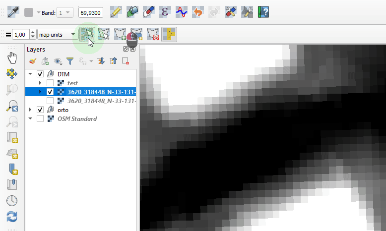
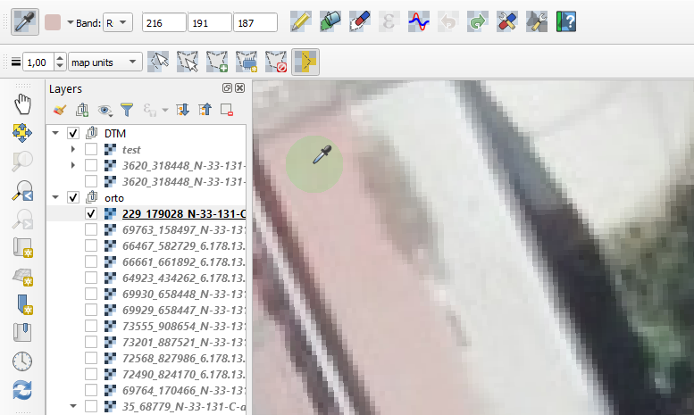
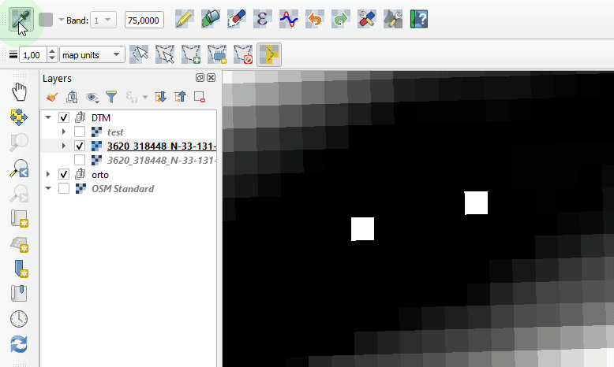

# Serval

Serval is a QGIS plugin for raster editing. 
It provides convenient tools for modifying (small) raster parts and is _not_ intended to process entire images - 
use Raster Calculator for this.
Users can select some portions of a raster and apply one of the following modifications to selected cells:
* set a constant value (including NODATA),
* apply a QGIS expression value,
* apply 3x3 low-pass filter,
* undo / redo.

Raster cell selection tools include:
* line selection with configurable width,
* polygon selection,
* loading selection from a vector map layer.

Multi-band rasters are fully supported - users can modify each band separately, or as RGB in case of 3/4-bands rasters.

Probing raster tool and drawing tool (changing single cell value) are also available.

## Supported raster formats

Please see the list of [raster drivers supported by GDAL](https://gdal.org/drivers/raster/index.html) - all drivers supporting raster CREATION should work with Serval.
For example, `Arc/Info ASCII Grid` is NOT supported.

## Selection tools

Users define parts of raster to be modified by selecting raster cells. 
Selection can be created from an existing map layer or digitised as a buffered line or a polygon.

Both digitising tools use **LMB** (left mouse button) to add points and **RMB** (right mouse button) to finish digitising.
Cancel current digitising using **ESC** key or just delete last point using **Backspace**.

**CTRL** and **Shift** key modifiers can be used to add another shape to selection or subtract from it, respectively.

### Line selection tool 

 button activates the **line selection** map tool. 
Selection line parameters are configurable in terms of width and unit and need to be set before digitising.

### Polygon selection tool

 button activates the **polygon selection** map tool. 

### Selection modes

Once selection geometry is created, it can be used to select underlying raster cells. 
There are to options for how cells get selected:
1. all cells touched by selection geometry
2. only those having center inside selection geometry

Check  button for option 1 and uncheck it for option 2.

### Create selection from map layer

 opens a dialog with a combobox listing loaded map layers.
Point and line geometry layers are buffured using current line width and unit. 
Polygon geometries are used for selection without any modification.  

### Create memory layer from selection

 creates a new polygon memory layer with current selection geometries.

### Clear selections

 removes any existing raster selection.

## Raster modification tools

### Band selection

For multi-band rasters users can edit each band separately, or have bands 1-3 as RGB.
For the latter, all 3 bands values are shown and editable at once. 
Please note that for RGB bands active, the expression builder is not available at the moment.

### Pencil tool

 activates pencil, or drawing tool, used for changin single cell values.

### Apply constant value

 applies current value(s) from band bands spin box(es) to all selected cells.

### Apply NoData

 Applies NoData value to selected cells.

If NoData is not defined or need to be changed, see [Changing raster NoData value](#change-raster-nodata-value).

### Apply QGIS expression value

 opens QGIS Expression Builder dialog.
Here, in the _Fields and Values_ variable group users will find the following variables for each cell feature:
* center point x coordinate
* center point y coordinate
* cell row number
* cell column number

 

Point geometry of current cell feature is also available under the usual `$geometry` variable. 

Make sure to create a raster selection before opening the builder.
It is used to create a temporary vector layer with a point feature in each selected cell. 
Keep in mind that for large selections creating and processing the layer can be time costly.

There are several expression functions defined in the _Serval_ group to allow for vector and mesh layer interpolations, 
see [Serval expression functions](#selection-modes).

**Important note**: When using other vector or mesh layers in the expression builder, make sure their sources have the same coordinate
system, equal to the raster CRS and, for best results, also project's CRS. 

### Apply 3x3 low-pass filter

 applies low-pass filter to each selected cell.
Arithmetic average for 3x3 cells block is calculated, so all peak values get reduced.

If current cell has NoData, it will stay NoData. 
If NoData is found in one of neighboring cells, it is ignored.

### Undo/Redo

 and  buttons are used for undo and redo last operations.
Number of undo steps to keep in memory is configurable. Default value is 3.

### Change raster NoData value 

 opens a dialog where current raster NoData value can be set.

## Plugin settings

 opens dialog window with plugin settings. 
Currently, only undo/redo steps to remember is available. 

## Serval expression functions

There are several expression functions registered when Serval is started.
They are available from _Serval_ of the central widget of QGIS Expression Builder. 

**Note**: When using them for raster modification, make sure that any vector or mesh layer used in the expression have the same
coordinate system as the raster.

### Function `interpolate_from_mesh`

For each cell selected, find out what is the mesh interpolated value at cell center and assign it to the cell.

Syntax:

`interpolate_from_mesh( mesh_id, group_index, dataset_index, above_existing )`

Arguments:

* `mlayer_id` - a mesh layer id - get it from _Map Layers_ group.
* `group` - dataset group index, an integer.
* `dataset` - dataset index in the group, an integer,
* `above_existing` - boolean, if `True`, only take the interpolation result if it is greater than existing raster value.

Users need to know the indices of dataset and group they want to use for interpolation. 

### Function `intersecting_features_attr_average`

For each cell selected, find features from the vector layer that intersects the cell and calculate arithmetic average 
of their attribute values. 

`intersecting_features_attr_average ( vlayer_id, attr_name, only_center )`

Arguments:

* `vlayer_id` - a vector layer id - get it from _Map Layers_ group.
* `attr_name` - name of attribute with the value to get.
* `only_center` - boolean, if True only cell center is used to find intersecting features. If False, whole raster cell is used.

### Function `nearest_feature_attr_value` 

Find the nearest feature from the vector layer and return its attribute value.

Syntax:

`nearest_feature_attr_value ( vlayer_id, attr_name )` 

Arguments:

* `vlayer_id` - linestring vector layer id - get it from _Map Layers_ group
* `attr_name` - name of attribute with the value to get

### Function `nearest_pt_on_line_interpolate_z` 

Find the nearest feature from the linestring vector layer and interpolate `z` value at point closest to current geometry.

Syntax:

`nearest_pt_on_line_interpolate_z ( vlayer_id ) `

Arguments:

* `vlayer_id` - linestring vector layer id - get it from _Map Layers_ group
